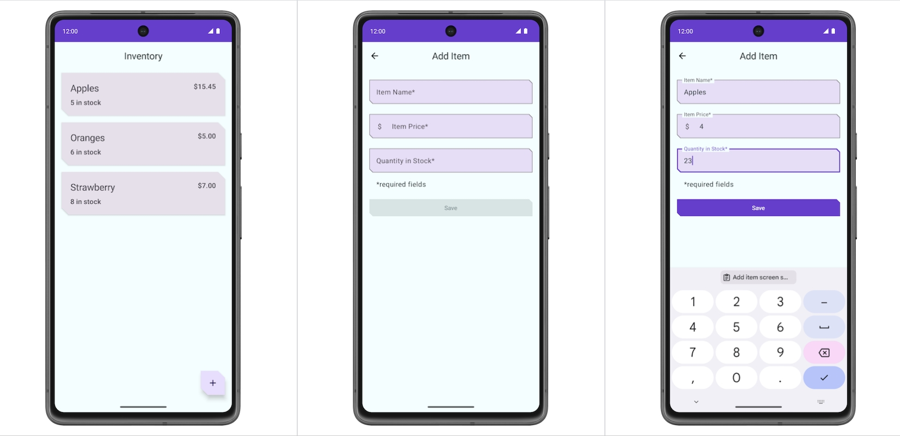

# 练习： Inventory

复刻
[Compose Base CodeLab - Inventory](https://developer.android.com/codelabs/basic-android-kotlin-compose-persisting-data-room?hl=zh-cn#1)



 练习使用下面的组件
 - Navigation
 - Hilt
 - Room

[参考代码](https://github.com/google-developer-training/basic-android-kotlin-compose-training-inventory-app/blob/main/app/src/main/java/com/example/inventory/MainActivity.kt)

## Tips
**Navigation with args**

```kotlin
interface NavigationDestination {
    val route: String,
    // StringRes Id
    val titleRes: Int
}

```

```kotlin
object ItemDetailsDestination : NavigationDestination {
    override val route = "item_edit"
    override val titleRes = R.string.edit_item_title
    const val itemIdArg = "itemId"
    val routeWithArgs = "$route/{$itemIdArg}"
}
```

```kotlin
composable(
    route = ItemDetailsDestination.routeWithArgs,
    arguments = listOf(navArgument(ItemDetailsDestination.itemIdArg) {
        type = NavType.IntType
    })
) {
    ItemDetailsScreen(
        navigateToEditItem = { navController.navigate("${ItemEditDestination.route}/$it") },
        navigateBack = { navController.navigateUp() }
    )
}
```